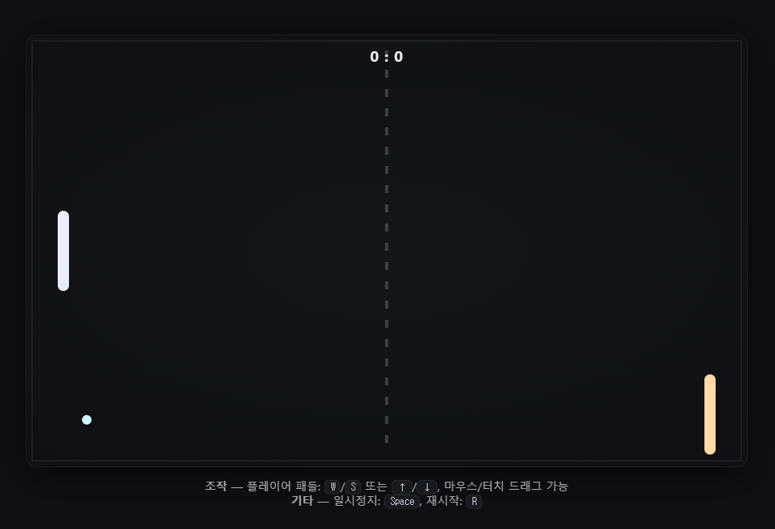

````markdown
# 🏓 Vite + React + TypeScript Ping Pong

간단한 **Ping Pong 게임**을 Vite + React + TypeScript로 구현한 프로젝트입니다.  
브라우저 **Canvas API**를 활용하여 공, 패들, 점수판, AI 상대 등을 렌더링합니다.  
개발환경은 **Vite(개발서버/HMR) + Rollup(빌드)**를 사용합니다.

---

## 📦 사전 준비(Prerequisites)

- **Node.js 18 이상** 권장 (Vite 5는 Node 18+ 필요)
- 패키지 매니저: **npm** (또는 yarn/pnpm도 가능)

```bash
node -v   # v18.x 이상이면 OK
npm -v
````

---

## 🚀 시작하기(Setup)

### 1) 저장소 클론

```bash
git clone https://github.com/kimss2x/vite_ts_pingpong.git
cd vite_ts_pingpong
```

### 2) 의존성 설치

```bash
npm install
```

> 만약 `@vitejs/plugin-react` 관련 오류가 난다면:
>
> ```bash
> npm i -D @vitejs/plugin-react
> ```
>
> (또는 더 빠른 빌드를 원하면 `@vitejs/plugin-react-swc` 사용 가능)

### 3) 개발 서버 실행 (HMR)

```bash
npm run dev
```

* 기본 주소: [http://localhost:5173](http://localhost:5173)
* 자동 오픈이 안 되면 브라우저로 수동 접속하세요.

### 4) 프로덕션 빌드 / 미리보기

```bash
npm run build     # dist/에 정적 파일 생성
npm run preview   # 빌드 결과 로컬 확인
```

---

## 🗂️ 프로젝트 구조

```
vite_ts_pingpong/
├─ index.html
├─ package.json
├─ tsconfig.json
├─ vite.config.ts
└─ src/
   ├─ main.tsx            # 앱 진입점: React 루트 마운트
   ├─ App.tsx             # 루트 컴포넌트(레이아웃/힌트)
   └─ PingPongCanvas.tsx  # Canvas 렌더링 + 게임 루프/로직
```

### 핵심 파일 설명

* **index.html**: Vite는 `index.html`을 **진입점**으로 사용합니다. 여기서 `/src/main.tsx`를 로드합니다.
* **vite.config.ts**: 개발 서버/빌드 동작 커스터마이즈(플러그인, 별칭, 포트 등).
* **src/PingPongCanvas.tsx**: 게임 상태 관리(패들/공 위치), 충돌 처리, AI 추적, DPR 스케일링, HMR 친화적 렌더 루프.

---

## 🎮 조작 방법(Controls)

* **플레이어 패들**

  * 키보드: `W` / `S` 또는 `↑` / `↓`
  * 마우스 이동 / 터치 드래그

* **기타**

  * `Space`: 일시정지 / 재개
  * `R`: 게임 재시작

---

## 🧠 게임 로직 개요

* **상태(State)**: `playerY`, `aiY`, `ball(x, y, vx, vy)`, `score`, `isPaused` 등
* **루프(Loop)**: `requestAnimationFrame` 기반, `dt`(프레임 간 시간)로 보정
* **충돌(Collision)**:

  * AABB 충돌 체크(공 vs 패들), 벽 반사
  * **마이크로 스텝 이동**으로 고속 이동 시 터널링(관통) 완화
* **반사(Reflection)**:

  * 패들 중앙 대비 맞은 위치로 반사각 계산
  * 속도 상한 및 점진 가속(`SPEEDUP_FACTOR`)
  * 패들 이동량 기반 **스핀** 소량 부여
* **DPR 스케일링**:

  * HiDPI(레티나 등) 환경에서 픽셀 밀도에 맞춰 캔버스 스케일 → 선명한 렌더링

---

## ⚙️ 환경 설정 & 스크립트

### npm 스크립트

```json
{
  "scripts": {
    "dev": "vite",
    "build": "tsc -b && vite build",
    "preview": "vite preview"
  }
}
```

### Vite 설정(vite.config.ts)에서 자주 쓰는 옵션

```ts
import { defineConfig } from 'vite'
import react from '@vitejs/plugin-react'

export default defineConfig({
  plugins: [react()],
  server: {
    open: true,
    port: 5173
  },
  resolve: {
    alias: { '@': '/src' }
  }
})
```

### 포트 충돌 시

```bash
# 다른 포트 사용 예
npm run dev -- --port=5174
```

혹은 `vite.config.ts`의 `server.port` 수정.

---

## 🧩 커스터마이징 팁

`PingPongCanvas.tsx` 상단의 상수만 바꿔도 게임 난이도/감각을 쉽게 조절할 수 있습니다.

```ts
const PADDLE_W = 14;
const PADDLE_H = 100;
const BALL_SIZE = 12;

const PLAYER_SPEED = 7;
const AI_MAX_SPEED = 6.2;

const BALL_START_SPEED = 5.2;
const BALL_MAX_SPEED = 9.5;
const SPEEDUP_FACTOR = 1.035;
```

* **난이도 올리기**: `AI_MAX_SPEED` ↑, `BALL_MAX_SPEED` ↑
* **게임 템포 빠르게**: `BALL_START_SPEED` ↑, `SPEEDUP_FACTOR` ↑
* **패들 더 길게/짧게**: `PADDLE_H` 조정
* **색상/스타일**: `drawRoundedRect`, `drawBall` 부분의 색상 변경

### (선택) 사운드 추가 예시

`public/` 폴더에 `hit.wav`, `score.wav` 등을 넣은 뒤:

```ts
const sndHit = new Audio('/hit.wav');
const sndScore = new Audio('/score.wav');

// 패들 충돌 시
sndHit.currentTime = 0; sndHit.play().catch(()=>{});

// 득점 시
sndScore.currentTime = 0; sndScore.play().catch(()=>{});
```

---

## 🚢 배포(Deploy)

### 정적 호스팅(예: GitHub Pages)

1. `vite.config.ts`에 `base` 설정 추가(저장소명에 맞춰 변경):

   ```ts
   export default defineConfig({
     base: '/vite_ts_pingpong/',  // 깃허브 페이지 경로
     plugins: [react()],
   })
   ```
2. 빌드:

   ```bash
   npm run build
   ```
3. **GitHub Pages**에 `dist/` 배포

   * 방법 A: `gh-pages` 패키지 사용

     ```bash
     npm i -D gh-pages
     npx gh-pages -d dist
     ```
   * 방법 B: GitHub Actions 워크플로 사용(예시):

     ```yaml
     name: Deploy
     on:
       push:
         branches: [ main ]
     jobs:
       build:
         runs-on: ubuntu-latest
         steps:
           - uses: actions/checkout@v4
           - uses: actions/setup-node@v4
             with: { node-version: 20 }
           - run: npm ci
           - run: npm run build
           - uses: peaceiris/actions-gh-pages@v3
             with:
               github_token: ${{ secrets.GITHUB_TOKEN }}
               publish_dir: ./dist
     ```

### Nginx 등 자체 서버

* `dist/` 폴더의 정적 파일을 그대로 서빙하면 됩니다.
* SPA 라우팅이 필요하다면 `try_files`로 `index.html`에 fallback 설정.

---

## 🧰 문제 해결(Troubleshooting)

* **`@vitejs/plugin-react`를 찾을 수 없습니다**
  → `npm i -D @vitejs/plugin-react`
  → Node 18+인지 확인
  → 프로젝트 루트에서 실행 중인지 확인(`package.json`, `vite.config.ts` 존재 경로)

* **포트 충돌(EADDRINUSE)**
  → `npm run dev -- --port=5174` 또는 `vite.config.ts`에서 `server.port` 변경

* **빈 화면 / 콘솔 에러**
  → 브라우저 DevTools(Console/Network) 확인
  → `index.html`의 `<script type="module" src="/src/main.tsx">` 경로 확인

* **문자 깨짐/이상한 바이너리 텍스트가 보임**
  → (서버 배포 시) gzip/헤더 설정 문제일 수 있음. 정적 파일을 그대로 서빙하거나, 서버가 압축 헤더를 올바르게 붙이도록 설정하세요.

---

## 📝 라이선스

MIT License

---

## 🙌 기여(Contributing)

이슈/PR 환영합니다!
버그 리포트 시 환경 정보(Node, OS, 브라우저)와 재현 방법을 함께 남겨 주세요.

---

## 📸 스크린샷

게임 실행 화면:



```

필요하면 `README.md` 안에 **GIF 데모**, **배포 링크**, **변경 이력(Changelog)** 섹션도 추가해 드릴게요.
```
